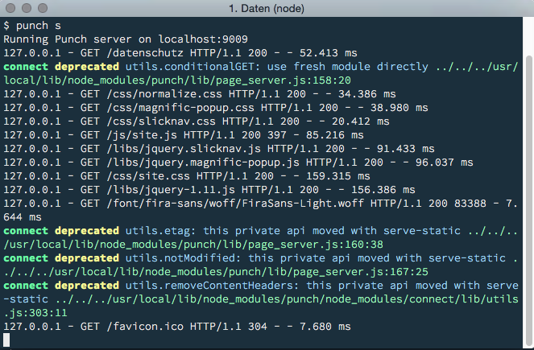
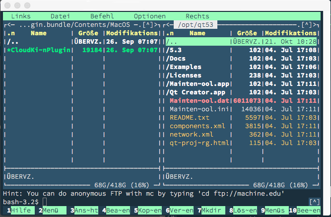

blueforest-iterm2
=================

An iterm2 theme inspired by the blueforest theme.

Installation
============
If you have installed iterm2, just download the [.itermcolors file](https://github.com/lichtzeichner/blueforest-theme/raw/master/iterm2/blueforest-dark.itermcolors) and import it into your iterm2.

How it looks like
=================

